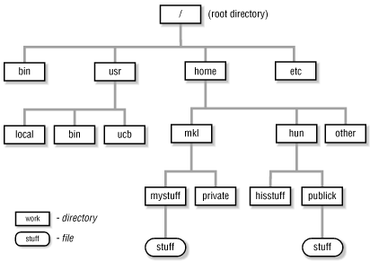

28 October 2019 \| Kathryn Mercier \| CUNY Graduate Center

This lab has been modified from the [Software Carpentry](https://software-carpentry.org/) lesson [The Unix Shell](http://swcarpentry.github.io/shell-novice/)

## __Objectives__

1. Understand why the command line is useful
2. Gain a basic toolkit to start using the command line
3. Be able to find resources to build your personal toolkit

## __1. Understand why the command line is useful__

We have many ways of interacting with computers. We can use a mouse and keyboard, touch screens, and even voice commands. When we interact with our personal computers, we are usually using a graphical user interface, or GUI. GUIs are a visual representation of a program and allow us to use the mouse and keyboard to click options and input arguments to run the program. 

While GUIs are intuitive and work well most of the time, imagine the following scenario. For a literature search, you have to copy the third line of one thousand text files in one thousand different directories and paste it into a single file. Using a GUI, you would not only be clicking at your desk for several hours, but you could potentially also commit an error in the process of completing this repetitive task. This is where we take advantage of the command line, allowing such repetitive tasks to be done automatically and fast. With the proper commands, the command line can repeat tasks as many times as we want.

Today, we will be using a Unix-based command line, used on Mac and Linux computers. Windows computers use a slightly different language for their command line, but the skills we learn should be transferable. Skills we will cover in this workshop include: navigating & creating folders; listing, searching & moving batches of files; editing & running shell scripts.

## __2. Gain a basic toolkit to start using the command line__

### _Fundamentals_

When you start up a terminal you will see a prompt

```shell
$ 
```

Lines beginning with # are comments and are not executed. The command line is used to run programs, which may have options and arguements

```shell
# This is the general format of unix command line tools
$ program -option1 -option2 argument
```

Here is an example of two programs

```shell
# The 'pwd' program with no option or argument prints your current location
$ pwd

# The 'ls' program with no option or argument prints the files and folders in your current location
$ ls 
```

You can find information about programs, including its options and arguments, using the help option

```shell
# Running a program with the -h option (short for 'help') will print information on that programs usage
$ ls -h
```

_What is your current location and what files and folders are in that location?_

### _The filesystem_



First, we are going to use the command line to download some files we will use in the rest of this workshop

```shell
# Download a zipped file named "data.zip" from the internet
$ wget kpmercier.github.io/workshop/data.zip

# Unzip the "data.zip" file
$ unzip data.zip
```

We can use the command line to point to locations in the filesystem

```shell
# The root (top) of the entire filesystem (used for writing full paths).
$ /

# Here, in my current directory (used for writing relative paths).
$ ./

# Up one directory from my current directory (a relative path).
$ ../
```

We can use the 'ls' command we learned to see files and folders in different locations in the filesystem

```shell
# Show files and folders in your current directory
$ ls ./

# show files and folders in another location on the filesystem
$ ls -l data/
```

_What do you think the default argument for 'ls' is?_

Now, lets learn a new command to move around the filesystem

```shell
# move to a new location. This becomes your new cur dir.
$ cd data/
```

### _Working with files_


We can make new folders in the filesystem

```shell
# make a new directory (mkdir is the program, genomics is the target)
$ mkdir thesis
# See the new folder in our current directory
$ ls
```

# change directory (move) into the new directory and run pwd again
$ cd workshop
$ pwd
```


### _Loops_

Loops are a programming construct which allow us to repeat a command or set of commands for each item in a list. As such they are key to productivity improvements through automation. Similar to wildcards and tab completion, using loops also reduces the amount of typing required (and hence reduces the number of typing mistakes).

Suppose we have several hundred genome data files named basilisk.dat, minotaur.dat, and unicorn.dat. For this example, we’ll use the creatures directory which only has three example files, but the principles can be applied to many many more files at once.

The structure of these files is the same: the common name, classification, and updated date are presented on the first three lines, with DNA sequences on the following lines. Let’s look at the files:

```shell
$ head -n 5 basilisk.dat minotaur.dat unicorn.dat
```

We would like to print out the classification for each species, which is given on the second line of each file. For each file, we would need to execute the command head -n 2 and pipe this to tail -n 1. We’ll use a loop to solve this problem, but first let’s look at the general form of a loop:

```shell
$ for thing in list_of_things
> do
>     operation_using $thing    # Indentation within the loop is not required, but aids legibility
> done
```

and we can apply this to our example like this:

```shell
$ for filename in basilisk.dat minotaur.dat unicorn.dat
> do
>    head -n 2 $filename | tail -n 1
> done
```

### _Finding Things_

In the same way that many of us now use ‘Google’ as a verb meaning ‘to find’, Unix programmers often use the word ‘grep’. ‘grep’ is a contraction of ‘global/regular expression/print’, a common sequence of operations in early Unix text editors. It is also the name of a very useful command-line program.

grep finds and prints lines in files that match a pattern. For our examples, we will use a file that contains three haikus taken from a 1998 competition in Salon magazine. For this set of examples, we’re going to be working in the writing subdirectory:

```shell
$ cd
$ cd Desktop/data-shell/writing
$ cat haiku.txt
```

Let’s find lines that contain the word ‘not’:

```shell
$ grep not haiku.txt
```
Here, not is the pattern we’re searching for. The grep command searches through the file, looking for matches to the pattern specified. To use it type grep, then the pattern we’re searching for and finally the name of the file (or files) we’re searching in.

The output is the three lines in the file that contain the letters ‘not’.

By default, grep searches for a pattern in a case-sensitive way. In addition, the search pattern we have selected does not have to form a complete word, as we will see in the next example.

Let’s search for the pattern: ‘The’.

```shell
$ grep The haiku.txt
```

grep’s real power doesn’t come from its options, though; it comes from the fact that patterns can include wildcards. (The technical name for these is regular expressions, which is what the ‘re’ in ‘grep’ stands for.) Regular expressions are both complex and powerful; if you want to do complex searches, please look at the lesson on our website. As a taster, we can find lines that have an ‘o’ in the second position like this:

```shell
$ grep -E '^.o' haiku.txt
```

[Finding Things exercise](FTexercise/)

### _Shell scripts_


## __3. Find resources to build your personal toolkit__

[Command Line Cheat Sheet](https://www.git-tower.com/blog/command-line-cheat-sheet/) PDF with listing common commands with short explanations

[Software Carpentry](https://software-carpentry.org/) lesson [The Unix Shell](http://swcarpentry.github.io/shell-novice/)

[Code Academy, Learn the command line](https://www.codecademy.com/learn/learn-the-command-line)
